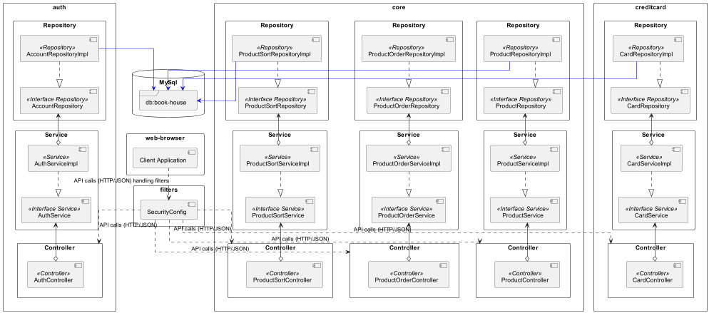
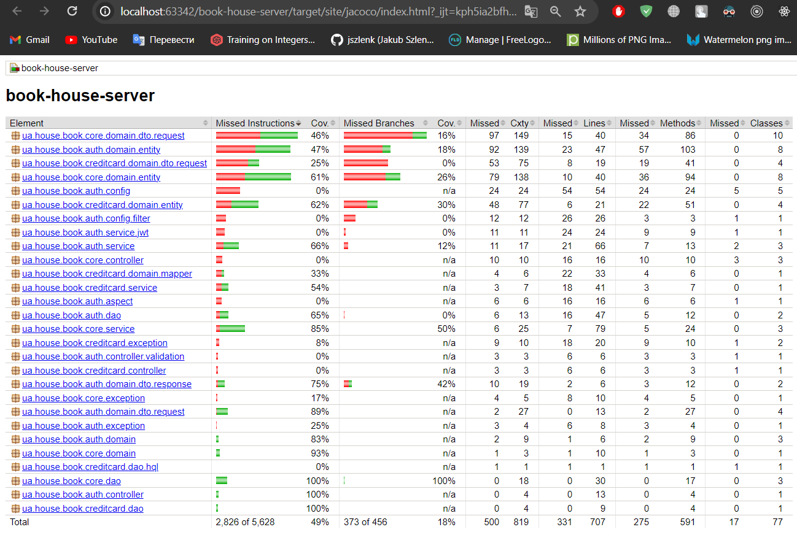
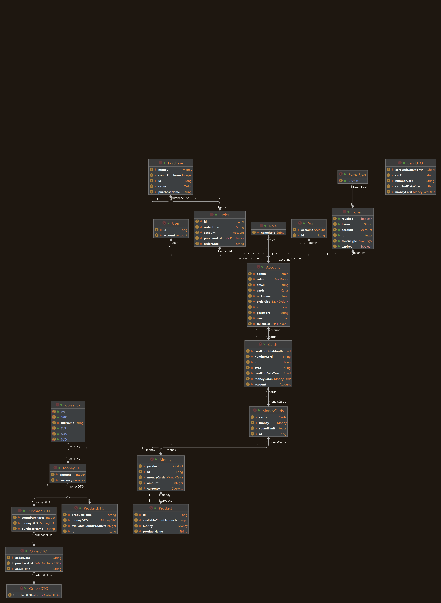
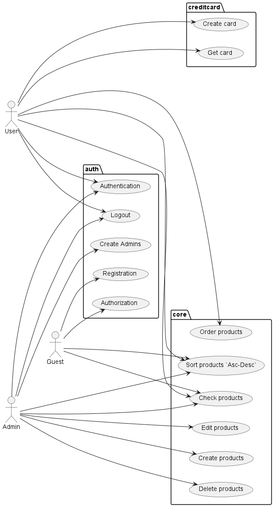
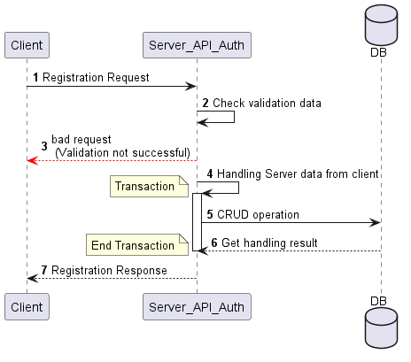
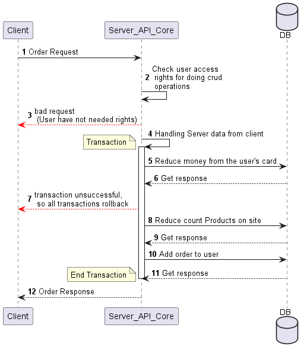
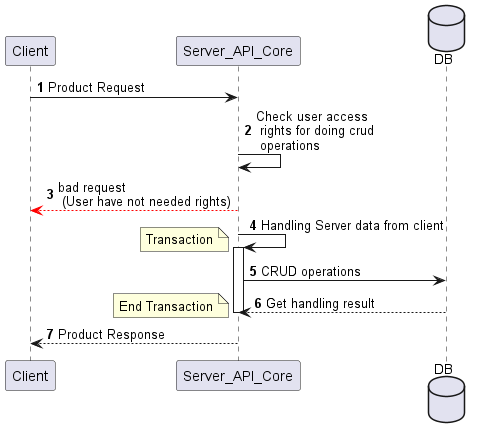

# Book House (server) 🏠📚📖

> Welcome to Book House (server), a project designed to manage, organize and seld books and named as book store with a
> user-friendly APIs.
> <br>
> > This project is build using Java 17, Hibernate, MySQL Driver, Spring Framework, Spring Security, Spring MVC, Spring
> > AOP, JWT
> > Authentication.
> <br>
> The testing was by JUnit5 and Mockito.
> <br>
> The Logging by Log4j2.
> <br>
> For execution application was using Tomcat 10.1.18.

## List of Contents

> - [Project Structure](#project-structure)
>- [Features](#features)
>- [Launch guide](#launch-guide)
>- [Domain Objects](#domain-objects)
>- [Usecase diagram](#usecase-diagram)
>- [Part of sequences diagram](#part-of-sequences-diagram)
>- [Patterns](#patterns)
>- [Author Info](#author-info)

### Project Structure

#### Architecture Diagram


___

- The project is a horizontal architected that include packages such as:
    - `auth`: This package encapsulates all the functionality related to
      authentication and authorization within the application.
      It includes components responsible for user authentication, registration, password management,
      role-based access control.
    - `core`:The core package contains essential and fundamental components that are used across different
      parts of the application. It includes common utilities, helper classes,
      or shared business logic that is used throughout the system.
    - `creditcard`: This package encapsulates functionality related to credit card processing within the application.

- The project is a vertical architected that include packages such as:
    - `controller`: This package contains the controllers responsible for handling incoming requests,
      interacting with the service layer, and returning appropriate responses to the client.
    - `service`: The service package houses the business logic of the application.
      It encapsulates operations and workflows that manipulate domain objects and perform various
      tasks required by the application. Services act as intermediaries between controllers and DAOs,
      implementing complex business rules and ensuring proper transaction management.
    - `dao`: The DAO (Data Access Object) package is responsible for handling data access and persistence operations.
      DAOs interact with the underlying database or data source, performing CRUD (Create, Read, Update, Delete)
      operations on domain objects.
    - `domain`: This package contains the domain model classes that represent the core entities and concepts of the
      application domain.
      Domain objects encapsulate the state and behavior of real-world entities, defining their properties,
      relationships.
___
### Features

- ☑️ ️Auth program:
    - ☑️Authorization;
    - ☑️Authentication;
    - ☑️Registration;
- ☑️ Core program;
    - ☑️ CRUD Production;
    - ☑️ Get all Products By ASC/DESC ordering;
    - ☑️ Create list order;
- ☑️ Credit card program;
    - ☑️ Create&read Card for user;
___
### Test coverage


> In the pom file you can see included between the tags `<plugins>`
> plugin `jacoco-maven-plugin` that gives us a comfortable possibility to
> check the coverage code tests.
___

### Launch guide

1. I would you recommended to clone my project from the GitHub.
   <br> If you wanna do this, please use this command:

```md  
git clone https://github.com/dima666Sik/book-house-server.git
```

2. To run this project you will need to install (or use docker images):
    - JDK 17 or higher;
    - MySQL RDBMS.

3. Please put your valid data in those properties.
   File stored in a `recourse` package, such as:

> `hibernate-mysql.properties`
> <br>
> `jwt.properties`
> <br>
> `log4j2.properties`

4. Here are the steps for you to follow:
    - Add this project to your IDE as `Maven` project.
    - If necessary, configure `Java SDK 17` in `Project Structure settings`.
    - You can change setting to your logging into `log4j2.properties`.
    - First, you will need to register as a new user.
5. Using Maven for compile, test, verify (integration test)
   and many others phases in lifecycle.
___
### Domain Objects

<br>
### Usecase diagram

<br>
### Part of sequences diagram
1. Module `auth`:
   <br>
    
   
   <br>
2. Module `core`:
   <br>
   
   

### Patterns
Firstly, it's important to note that we aim to adhere to S.O.L.I.D. principles in designing the application. 
<br>In this project, we will be utilizing the following design patterns:
- Transaction Script Pattern (Example: processing an order involves deducting funds from the customer's card, reducing the quantity of items in the bookstore, and adding a new order). 
- Domain Model Pattern (Usage: Instead of a single procedure handling all the business logic for a user action, there are multiple objects, each handling a portion of the domain logic relevant to it). 
- Domain Access Layer Pattern (Usage: a set of thin interfaces placed on top of the domain model). 
- Operation Script Pattern (Usage: implemented as a multitude of "thicker" classes directly incorporating the application logic, accessing data as necessary from the layer below). 
- Data Transfer Object Pattern (Usage: employed to transfer data between processes to reduce the number of remote calls). 
- Supertype Layer Pattern (Usage: to eliminate code duplication when the same properties and methods are duplicated across all layer objects). 
- Data Access Object Pattern (Usage: implements the necessary data source operations access mechanism). 
- Inversion of Control Pattern (Usage: delegating object creation higher up the layer, for example, using DI).

### Author Info

- [Linkedin](https://www.linkedin.com/in/dmytro-kohol-333a7a2aa/)

- [GitHub](https://github.com/dima666Sik)

[Back To The Top](#list-of-contents)